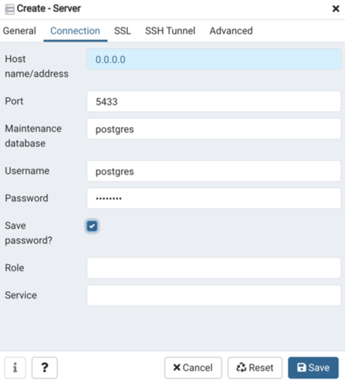
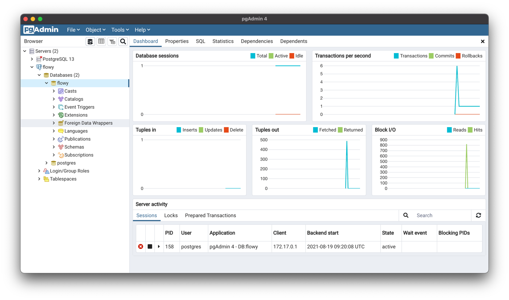

### Docker

1. follow the [instructions](https://docs.docker.com/desktop/mac/install/) to install docker.
2. open terminal and run: `docker pull postgres`
   
3. run `make init_docker` if you have not run before. You can find out the running container by run `docker ps`
```
CONTAINER ID   IMAGE      COMMAND                  CREATED          STATUS          PORTS                                       NAMES
bfcdd6369e89   postgres   "docker-entrypoint.s…"   19 minutes ago   Up 19 minutes   0.0.0.0:5433->5432/tcp, :::5433->5432/tcp   brave_bassi
```

4. run `make init_database`. It will create the database on the remote specified by DATABASE_URL. You can connect you database using 
pgAdmin.



The information you enter must be the same as the `make init_docker`. e.g.
```
export DB_USER=postgres
export DB_PASSWORD=password
export DB_NAME=flowy
export DB_PORT=5433
```



[Docker command](https://docs.docker.com/engine/reference/commandline/builder_prune/)

### Run
By default, Docker images do not expose their ports to the underlying host machine. We need to do it explicitly using the -p flag.
`docker run -p 8000:8000 backend`